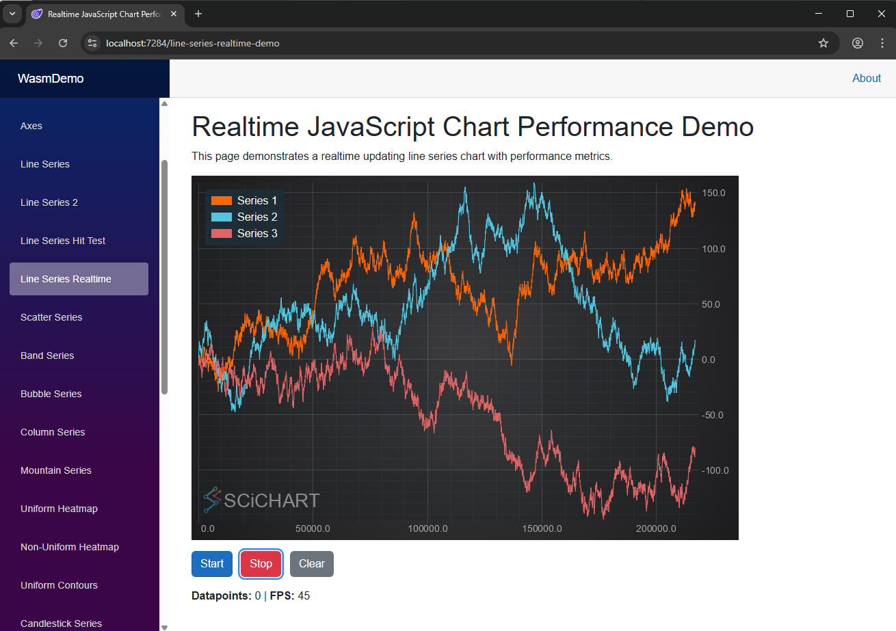

# SciChart.Blazor.Examples



## How to run the demo

Most of examples are in WasmDemo. In order to run:

* `cd WasmDemo`
* `dotnet run`
* Open link in the browser http://localhost:5078/

For running ServerDemo:

* `cd ServerDemo`
* `dotnet run`
* Open link in the browser http://localhost:5175/

## How to use SciChartBlazor from scratch

**Steps to create a Wasm Demo from scratch**

1. Create a project `dotnet new blazorwasm -o MyBlazorWasmApp`
2. Install SciChartBlazor nuget package
	* `dotnet nuget add source https://www.myget.org/F/abtsoftware-bleeding-edge/api/v3/index.json --name "ABT Bleeding Edge"`
	* `dotnet nuget list source`
	* `dotnet add package SciChartBlazor --version 4.0.93302`
3. Add imports to `_imports.razor` file
	* `@using static Microsoft.AspNetCore.Components.Web.RenderMode`
	* `@using SciChartBlazor.Components`
4. Create a Page under pages `Demo.razor`
```
@page "/demo"
@rendermode InteractiveWebAssembly

<PageTitle>Annotations</PageTitle>

<div id="demo" style="display: flex; gap: 20px; align-items: flex-start;">
    <div style="width: 600px; flex-shrink: 0;">
        <SciChartSurface @ref="_sciChartRef" HeightAspect="2" WidthAspect="3">
            <XAxes>
                <NumericAxis />
            </XAxes>
            <YAxes>
                <NumericAxis />
            </YAxes>
            <MouseWheelZoomModifier />
            <ZoomPanModifier />
        </SciChartSurface>
    </div>
</div>
```
5. Run the application

# SciChartBlazor Nuget Readme

SciChartBlazor is Blazor component library that wraps [SciChart.js](https://www.scichart.com/) — a high-performance WebGL charting library — enabling its use in Blazor Server and Blazor WebAssembly applications.

Current version of nuget package supports only 2D charts, Polar Charts and Pie Charts are not supported at the moment. The package is based on SciChart.js version `4.0.933`.
All charts that are in the library support initial creation and data append. However, only FastLineRenderableSeries has been well tested at the moment.

## Getting Started

### 1. Install the package

```shell
dotnet add package SciChartBlazor
```

### 2. Add the namespace import

In `_imports.razor`:

```razor
@using SciChartBlazor.Components
```

### 3. Add a chart to your page

```razor
@page "/my-chart"

<SciChartSurface HeightAspect="2" WidthAspect="3">
    <XAxes>
        <NumericAxis />
    </XAxes>
    <YAxes>
        <NumericAxis />
    </YAxes>
    <FastLineRenderableSeries Stroke="#FF6600" StrokeThickness="2" SeriesName="My Series">
        <XyDataSeries XValues="@(new double[] { 0, 1, 2, 3, 4 })"
                      YValues="@(new double[] { 0, 1, 0.5, 1.5, 1 })" />
    </FastLineRenderableSeries>
    <MouseWheelZoomModifier />
    <ZoomPanModifier />
</SciChartSurface>
```

## Supported Chart Types

| Series | Description |
|---|---|
| `FastLineRenderableSeries` | Line chart |
| `SplineLineRenderableSeries` | Smoothed spline line chart |
| `FastMountainRenderableSeries` | Filled mountain/area chart |
| `FastColumnRenderableSeries` | Bar/column chart |
| `FastCandlestickRenderableSeries` | Candlestick (OHLC) chart |
| `FastOhlcRenderableSeries` | OHLC chart |
| `FastBandRenderableSeries` | Band/range chart |
| `FastBubbleRenderableSeries` | Bubble chart |
| `XyScatterRenderableSeries` | Scatter chart |
| `FastImpulseRenderableSeries` | Impulse/stem chart |
| `FastErrorBarsRenderableSeries` | Error bars |
| `UniformHeatmapRenderableSeries` | Heatmap |
| `StackedColumnCollection` | Stacked columns |
| `StackedMountainCollection` | Stacked mountain |
| and more... | |

## Axis Types

- `NumericAxis`
- `CategoryAxis`
- `DateTimeNumericAxis`

## Chart Modifiers (Interactions)

- `MouseWheelZoomModifier` — scroll to zoom
- `ZoomPanModifier` — drag to pan
- `RubberBandXyZoomModifier` — drag to zoom a region
- `RolloverModifier` — cursor tooltip
- `ZoomExtentsModifier` — double-click to fit chart
- `XAxisDragModifier` / `YAxisDragModifier` — drag axes to pan/scale
- `DataPointSelectionModifier` — click to select data points
- `LegendModifier` — interactive chart legend

## Appending Data at Runtime

Get a reference to a data series and call `AppendRange`:

```razor
<FastLineRenderableSeries Stroke="blue">
    <XyDataSeries @ref="_series" />
</FastLineRenderableSeries>

@code {
    XyDataSeries? _series;

    async Task AppendData()
    {
        await _series!.AppendRange(
            new double[] { 5, 6 },
            new double[] { 1.2, 0.8 }
        );
    }
}
```

## Events

```razor
<SciChartSurface OnSciChartSurfaceRendered="OnRendered">
    <XAxes>
        <NumericAxis OnVisibleRangeChanged="OnRangeChanged" />
    </XAxes>
    ...
</SciChartSurface>
```

## Requirements

- .NET 8.0
- A valid [SciChart license](https://www.scichart.com/licensing-scichart-js/) for production use

## License

Copyright (c) SciChart Ltd. All rights reserved.

See the [SciChart licensing page](https://www.scichart.com/licensing-scichart-js/) for details.
